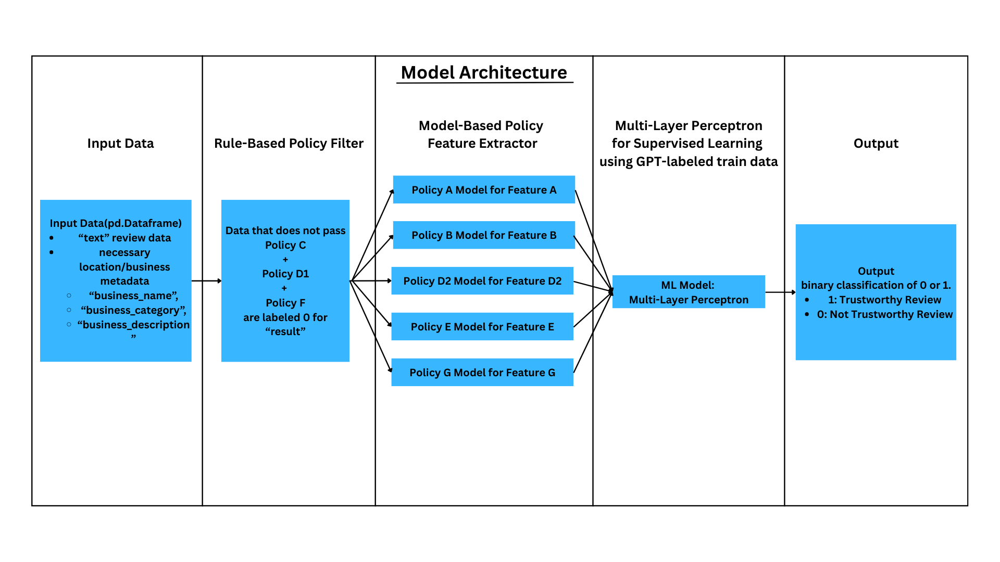
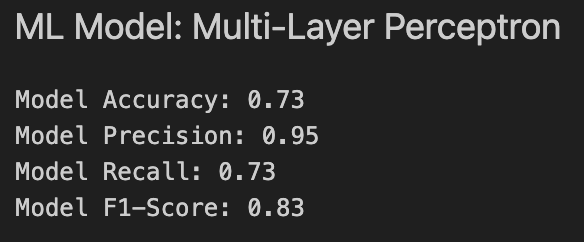

# TikTok TechJam 2025
### Track 1. Filtering the Noise: ML for Trustworthy Location Reviews
This project develops a comprehensive machine learning pipeline designed to assess the trustworthiness of location-based Google reviews. 

## Project Overview

- To address this challenge, we designed a machine learning pipeline grounded in a seven-policy framework. 
- The system first applies rule-based filters to automatically flag reviews that explicitly violate certain criteria (Policy C, D1, F). 
- For the remaining dimensions (Policy A, B, D2, E, G), feature scores are extracted using pre-trained language models such as HuggingFace transformers and Detoxify. 
- These policy-aligned features are then combined and fed into a multi-layer perceptron (MLP), which learns to classify reviews as trustworthy (1) or untrustworthy (0).
- This layered framework blends deterministic rules with learned representations, ensuring both precision and adaptability in detecting low-quality or deceptive reviews.

This project is divided into three main parts:

1.  **Data Labeling:** Using GPT API to label the raw Google review data based on a defined policy for supervised learning, leveraging prompt engineering.
2.  **Feature Engineering:** Extracting features from the labeled data using different pre-trained models for certain specific policies.
3.  **Classification:** Training and evaluating different classification models on the engineered features and develop one final model with highest performance. 

The policies defined in project are:

- **Policy A: Business Category/Name & Review Content Alignment**
- **Policy B: Overly Generic Sentiment with No Substance**
- **Policy C: Minimum Review Content Length**
- **Policy D: Nonsensical Content**
    - **Policy D1: Non-Alphanumeric**
    - **Policy D2: No Meaning**
- **Policy E: Do Ratings Match the Sentiment of Text Review?**
- **Policy F: Advertisement-like Review Filter**
- **Policy G: Excessive Use of Profanity/Hate Speech**

#### More Information can be found in [Google Doc](https://docs.google.com/document/d/1tCkZP4Z8YLQJ1Ee284itrMSlIuicsvdhtb2rCdfqbUU/edit?usp=sharing)

## Model Validation Score Result


## Repository Structure

```
.
├── classification_model/       # Jupyter notebooks for classification models (MLP, RF, SVM, XGB)
├── data_gpt_labeler/           # Scripts and notebooks for data labeling with GPT
│   ├── filtered_datasets/      # Filtered datasets
│   └── labeled_datasets/       # GPT-labeled datasets
├── feature_engineering_model/  # Jupyter notebooks for feature engineering
│   ├── featured_datasets/      # Datasets with engineered features
│   └── modules/                # Python modules for feature engineering policies
├── images/                     # Images for the repository
├── .gitignore                  # Git ignore file
├── final_data_featured_filtered.csv # Final dataset for classification
├── final_lda_train_data.csv    # Train data for LDA model
├── final_ml_pipeline.ipynb     # Jupyter notebook for the final ML pipeline
├── README.md                   # This file
└── requirements.txt            # Python dependencies
```

## Setup Instructions

1.  **Clone the repository:**
    ```bash
    git clone <repository-url>
    cd TikTok-TechJam-2025
    ```

2.  **Create a virtual environment:**
    ```bash
    python3 -m venv venv
    source venv/bin/activate
    ```

3.  **Install dependencies:**
    ```bash
    pip install -r requirements.txt
    ```

4.  **Set up OpenAI API Key:**
    The data labeling script for the generation of training dataset uses the OpenAI API. You need to set up your API key as an environment variable:
    ```bash
    export OPENAI_API_KEY='your-api-key'
    ```

## How to Reproduce Results
Simply run the `final_ml_pipeline.ipynb` from top to bottom to reproduce the results displayed in the video demonstration. 

For a more thorough understanding of the implementation, follow the procedure delineated below:

1.  **Data Labeling:**
    - Navigate to the `data_gpt_labeler` directory.
    - Run the `data_preprocessing.ipynb` notebook, based on user specified dataset from [link](https://mcauleylab.ucsd.edu/public_datasets/gdrive/googlelocal/) to preprocess the data.
    - Run the `data_gpt_labeler_v2.py` script to label the data using GPT. This will generate the labeled datasets in the `labeled_datasets` directory.
    - *may require some absolute paths be updated with relative paths*

2.  **Feature Engineering:**
    - Navigate to the `feature_engineering_model` directory.
    - Run the `data_feature_extraction.ipynb` notebook. This notebook will use the modules in the `modules` directory to generate features from the labeled data. The resulting datasets with engineered features will be saved in the `featured_datasets` directory.

3.  **Classification:**
    - Navigate to the `classification_model` directory.
    - The `final_data_featured_filtered.csv` file is the final dataset used for classification.
    - You can run any of the notebooks (`MLP.ipynb`, `RF.ipynb`, `SVM.ipynb`, `XGB.ipynb`) to train and evaluate the corresponding classification model.

## Team Member
**Lee Hyunseung** ([LinkedIn](https://www.linkedin.com/in/hyunseung-lee-0128jte-10627kshs/))

**Park Yumin** ([LinkedIn](https://www.linkedin.com/in/yuminpark78/))

**Yoon Hyukjin** ([LinkedIn](https://www.linkedin.com/in/hyukjiny/))
